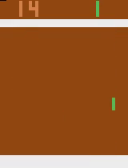
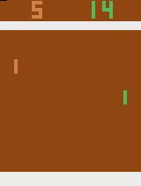

# Deep reinforcement learning algorithms in Atari Pong

## Summary
  Goal of this aplication is to find out how accurate and effective can Deep Q-Learning (DQN) be on Atari 1600 game of Pong in OpenAI enviroment. On top of DQN, aditional improvements on same algorithm were tested including Multi-step DQN, Double DQN and Dueling DQN. Result that can be seen on graph below show that basic DQN achieves human-like accuracy after only ~110 played games and great accuracy after 300 games. Improved versions of DQN considered in this project showed some improvement in both efficiancy and accuracy.   
  
 


Basic DQN: Episode 1 vs Episode 216

## Enviroment
  Atari 1600 emulator is made by OpenAI in which you can test your reinforcement algorithms on 59 different games. Deep reinforcement learning is used because input is RGB picture of current frame (210x160x3). Since RGB picture is too much computationally expensive, it is turned to grayscale. Next is downsampling and cutting image to playable area which is 84x84x1. https://gym.openai.com/envs/Pong-v0/
  


*Grayscale, downsampling and cropped*  

## DQN
  For the DQN implementation and the choose of the hyperparameters, I mostly followed [Mnih et al.](https://storage.googleapis.com/deepmind-media/dqn/DQNNaturePaper.pdf). I improved the basic DQN, implementing some variations like **Double Q-learning**, **Dueling networks** and **Multi-step learning**. You can find them summarized by [Hessel et al.](https://arxiv.org/pdf/1710.02298.pdf). 
  For more in detail about each improved version of DQN you can check out these papers:
  
  * Multi-step DQN - [The "Bible" of Reinforcement Learning: Chapters 7 - Sutton & Barto](https://www.amazon.com/Reinforcement-Learning-Introduction-Adaptive-Computation/dp/0262039249/ref=as_li_ss_tl?keywords=reinforcement+learning&qid=1567849400&s=gateway&sr=8-1&linkCode=sl1&tag=andreaaffilia-20&linkId=e05d8ab8146051d903abb166926f6bce&language=en_US&tag=andreaaffilia-20)
  * [Double DQN](https://arxiv.org/pdf/1509.06461.pdf)
  * [Dueling DQN](http://proceedings.mlr.press/v48/wangf16.pdf)

## Results


## Rest of data and TensorBoard
  Rest of training data can be found at [/content/runs](https://github.com/leonjovanovic/deep-reinforcement-learning-atari-pong/tree/main/content/runs). If you wish to see it and compare with rest I recommend using TensorBoard. After installation simply change directory where data is stored and use command
  
```python
LOG_DIR = "full\path\to\data"
tensorboard --logdir=LOG_DIR --host=127.0.0.1
```
and open http://localhost:6006 in your browser.
For information about installation and further questions visit [TensorBoard github](https://github.com/tensorflow/tensorboard/blob/master/README.md)

## Future improvements
  For further improvements on efficiency and accuracy we can do couple of things:
  
  * Smaller epsilon decay, bigger replay memory size, longer training time may produce better results
  * Implement [Prioritized Experience Replay](https://arxiv.org/pdf/1511.05952.pdf)
  * Implement [Noisy Networks for Exploration](https://arxiv.org/pdf/1706.10295.pdf)
  


