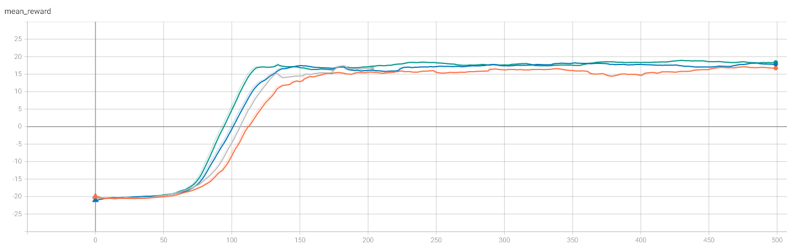
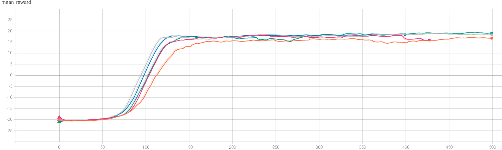

# Deep Q-Learning algorithms on Atari game Pong

## Summary
&nbsp;&nbsp;&nbsp;&nbsp;The goal of this application is to find out how accurate and effective can Deep Q-Learning (DQN) be on Atari 1600 game of Pong in OpenAI environment. On top of DQN, additional improvements on the same algorithm were tested, including Multi-step DQN, Double DQN and Dueling DQN. Results that can be seen on the graph below show that basic DQN achieves human-like accuracy after only ~110 played games and great accuracy after 300 games. Improved versions of DQN considered in this project showed greater efficiency and accuracy.   
  
 


Basic DQN: Episode 1 vs Episode 216

## Environment
&nbsp;&nbsp;&nbsp;&nbsp;Atari 1600 emulator is made by OpenAI in which you can test your reinforcement algorithms on 59 different games. Deep reinforcement learning is used because the input is a RGB picture of the current frame (210x160x3). Since the picture is computationally too expensive, it is turned to grayscale. Next is downsampling and cutting the image to a playable area, which size is 84x84x1. https://gym.openai.com/envs/Pong-v0/
  


*Grayscale, downsampling and cropped*  

---
&nbsp;&nbsp;&nbsp;&nbsp;In Pong, every game is played until one side earns 21 points. A point is gained when the other side didn't manage to return the ball. In terms of rewards for our agent, he gains -1 reward if he misses the ball, +1 reward if opponent misses the ball and 0 reward in every other case. After one side collects 21 points, total reward gained is calculated by the agent. Therefore minimum total reward is -21, human-like performance is over 0 and +21 is the best possible outcome.

## DQN
&nbsp;&nbsp;&nbsp;&nbsp;For the DQN implementation and the choosing of the hyperparameters, I mostly followed [Mnih et al.](https://storage.googleapis.com/deepmind-media/dqn/DQNNaturePaper.pdf). I improved the basic DQN, implementing some variations like **Double Q-learning**, **Dueling networks** and **Multi-step learning**. You can find them summarized by [Hessel et al.](https://arxiv.org/pdf/1710.02298.pdf). 
  For more details about each improved version of DQN you can check out these papers:
  
  * Multi-step DQN - [The "Bible" of Reinforcement Learning: Chapters 7 - Sutton & Barto](https://www.amazon.com/Reinforcement-Learning-Introduction-Adaptive-Computation/dp/0262039249/ref=as_li_ss_tl?keywords=reinforcement+learning&qid=1567849400&s=gateway&sr=8-1&linkCode=sl1&tag=andreaaffilia-20&linkId=e05d8ab8146051d903abb166926f6bce&language=en_US&tag=andreaaffilia-20)
  * [Double DQN](https://arxiv.org/pdf/1509.06461.pdf)
  * [Dueling DQN](http://proceedings.mlr.press/v48/wangf16.pdf)

## Results
&nbsp;&nbsp;&nbsp;&nbsp;Efficiency and accuracy are two main factors in calculating how good the results are. Efficiency means how quickly the agent achieves human-like level and accuracy represents how close is the agent to total reward of +21. Graphs represent how high was mean total reward (on last 40 games) after each game. The agent trained for each variation of algorithm for up to 500 games.
  
### Optimizers
&nbsp;&nbsp;&nbsp;&nbsp;Adam and RMSProp optimizers were the ones tested in this project. Graph with results comparing the two optimizers can be seen below. It is clear that RMSProp outperformed Adam in these tests, although more test runs are needed for better average values before giving a clear verdict. Some other optimizers can be tested in the future, like SGD or Adamax.



-  `Basic DQN Adam`
-  `Basic DQN RMSProp`
-  `2-step DQN Adam`
-  `2-step DQN RMSProp`

### Algorithms
&nbsp;&nbsp;&nbsp;&nbsp;A few selected variations of implemented algorithms are shown below. Although it looks like 2 step DQN and Double DQN outperformed Dueling DQN in efficiency, important note to keep in mind is that these results need to be averaged over many runs, as both Double DQN and 2 step DQN showed high variancy in results (both better and worse than Dueling DQN). As for accuracy, Dueling DQN mixed with other variations of DQN showed the best results. For more information about viewing all of the data, check out the next section.



-  `Basic DQN Adam`
-  `2-step Dueling DQN RMSProp`
-  `2-step Dueling Double DQN RMSProp`
-  `2-step Double DQN RMSProp`
-  `2-step DQN RMSProp`

---

  * Mean total reward in last 10 games
    * Best efficiency recorded: **2-step DQN RMSProp - after 79 games**
    * Best accuracy recorded: **2-step Dueling Double DQN RMSProp - 20.30 score (after 444 games)**

  * Mean total reward in last 40 games
    * Best efficiency recorded: **2-step DQN RMSProp - after 93 games**
    * Best accuracy recorded: **2-step Dueling Double DQN RMSProp - 19.48 score (after 473 games)**
    
## Rest of the data and TensorBoard
&nbsp;&nbsp;&nbsp;&nbsp;Rest of the training data can be found at [/content/runs](https://github.com/leonjovanovic/deep-reinforcement-learning-atari-pong/tree/main/content/runs). If you wish to see it and compare it with the rest, I recommend using TensorBoard. After installation simply change the directory where the data is stored, use the following command
  
```python
LOG_DIR = "full\path\to\data"
tensorboard --logdir=LOG_DIR --host=127.0.0.1
```
and open http://localhost:6006 in your browser.
For information about installation and further questions visit [TensorBoard github](https://github.com/tensorflow/tensorboard/blob/master/README.md)

## Telegram bot
&nbsp;&nbsp;&nbsp;&nbsp;Since every run of up to 500 games takes about 3.5 - 4.5 hours, I implemented a Telegram bot to send me updates on how my training is doing. It can easily be created with the next few steps. 
  * The first step is to create a new bot (sending '/newbot' command to *BotFather* and following his instructions). From *BotFather* you will get TOKEN_ID. 
  * The second step is to send any message to your bot and go to 'https://api.telegram.org/botTOKEN_ID/getUpdates' where you replace TOKEN_ID with your token. There you will find CHAT_ID (result -> 0 -> message -> from -> id = CHAT_ID). Replace **CHAT_ID** and **TOKEN_ID** in *telegram_bot.py* with yours and you are good to go.
  
```python
def telegram_send(message):
    chat_id = "CHAT_ID"
    token = "TOKEN_ID"
    bot = Bot(token=token)
    bot.send_message(chat_id=chat_id, text=message)
```
## Future improvements
&nbsp;&nbsp;&nbsp;&nbsp;For further improvements on efficiency and accuracy, we can do a couple of things:
  
  * Smaller epsilon decay, bigger replay memory size and longer training time may produce better results
  * Implement [Prioritized Experience Replay](https://arxiv.org/pdf/1511.05952.pdf)
  * Implement [Noisy Networks for Exploration](https://arxiv.org/pdf/1706.10295.pdf)
  


